# SISOP-1-2026-IT-031

## Identitas
| No | Nama | NRP |
|----|------|-----|
| 1  | Dian Piramidiana Rachmatika | 5027251031 |

## Soal 1 - ARGO NGAWI JESGEJES
Soal 1 menggunakan AWK untuk menganalisis data penumpang kereta KANJ dari file passenger.csv. Script KANJ.sh dibuat untuk menjawab 5 sub-soal yaitu menghitung total penumpang, jumlah gerbong unik, penumpang tertua, rata-rata usia, dan jumlah penumpang Business Class.

## Soal 1 - ARGO NGAWI JESGEJES
Soal 1 menggunakan AWK untuk menganalisis data penumpang kereta KANJ dari file passenger.csv. Script KANJ.sh dibuat untuk menjawab 5 sub-soal yaitu menghitung total penumpang, jumlah gerbong unik, penumpang tertua, rata-rata usia, dan jumlah penumpang Business Class.

### Penjelasan Program

#### A. Struktur Dasar KANJ.sh
Script menerima 2 parameter:
- `$1` = nama file CSV
- `$2` = mode (a/b/c/d/e)
```bash
FILE=$1
SOAL=$2
```

#### B. Validasi Input
```bash
if [ -z "$FILE" ] || [ -z "$SOAL" ]; then
    echo "Penggunaan: ./KANJ.sh passenger.csv a/b/c/d/e"
    exit 1
fi
```
**Penjelasan:**
- `-z` digunakan untuk mengecek apakah variabel kosong
- Jika FILE atau SOAL kosong, program akan berhenti dan menampilkan pesan error

#### C. Mode A — Hitung Total Penumpang
```bash
count_passenger=$(awk -F',' 'NR>1 {count++} END {print count}' $FILE)
echo "Jumlah seluruh penumpang KANJ adalah ${count_passenger} orang"
```
**Penjelasan:**
- `-F','` menentukan pemisah kolom adalah koma
- `NR>1` untuk melewati baris header
- `count++` menghitung jumlah baris data

#### D. Mode B — Hitung Jumlah Gerbong Unik
```bash
carriage=$(awk -F',' 'NR>1 {gerbong[$4]=1} END {print length(gerbong)}' $FILE)
echo "Jumlah gerbong penumpang KANJ adalah ${carriage}"
```
**Penjelasan:**
- `gerbong[$4]=1` menyimpan nama gerbong sebagai key array
- Array otomatis menghilangkan duplikat
- `length(gerbong)` menghitung jumlah elemen unik

#### E. Mode C — Cari Penumpang Tertua
```bash
age=$(awk -F',' 'NR>1 {if($2+0>max+0) max=$2} END {print max}' $FILE)
nama=$(awk -F',' -v m="$age" 'NR>1 && $2==m {print $1}' $FILE)
echo "${nama} adalah penumpang kereta tertua dengan usia ${age} tahun"
```
**Penjelasan:**
- AWK pertama mencari nilai usia tertinggi
- AWK kedua mencari nama penumpang yang usianya sama dengan usia tertinggi
- `$2+0` digunakan untuk memastikan perbandingan dilakukan secara numerik

#### F. Mode D — Hitung Rata-rata Usia
```bash
average_age=$(awk -F',' 'NR>1 {total+=$2; count++} END {print int(total/count)}' $FILE)
echo "Rata-rata usia penumpang adalah ${average_age} tahun"
```
**Penjelasan:**
- `total+=$2` menjumlahkan semua usia
- `count++` menghitung jumlah penumpang
- `int()` membulatkan hasil pembagian ke bawah

#### G. Mode E — Hitung Penumpang Business Class
```bash
business_passenger=$(awk -F',' 'NR>1 && $3=="Business" {count++} END {print count}' $FILE)
echo "Jumlah penumpang business class ada ${business_passenger} orang"
```
**Penjelasan:**
- `$3=="Business"` memfilter hanya baris dengan kelas Business
- `count++` menghitung jumlah penumpang Business Class

### Cara Menjalankan
```
cd soal_1
./KANJ.sh passenger.csv a
./KANJ.sh passenger.csv b
./KANJ.sh passenger.csv c
./KANJ.sh passenger.csv d
./KANJ.sh passenger.csv e
```

### Output
1. **Output Mode A** (jumlah seluruh penumpang)
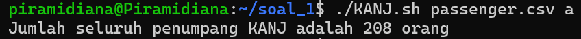
2. **Output Mode B** (jumlah gerbong)
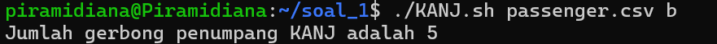
3. **Output Mode C** (penumpang tertua)
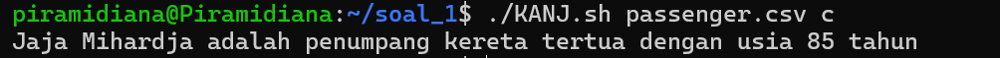
4. **Output Mode D** (rata-rata usia)
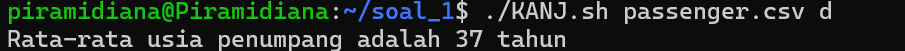
5. **Output Mode E** (jumlah Business Class)
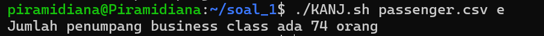
6. **Output Semua Mode**
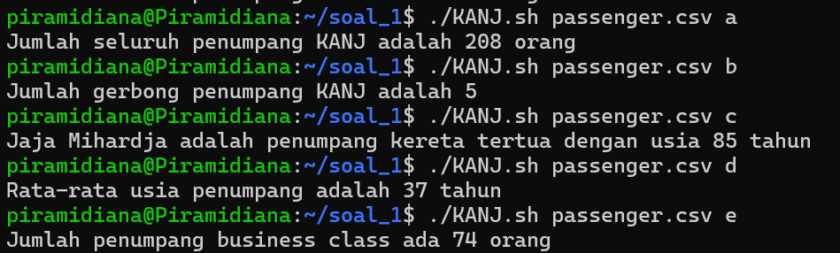

## Soal 2 - EKSPEDISI GUNUNG KAWI
Soal 2 melibatkan download file PDF menggunakan gdown, membaca isi PDF dengan cat untuk menemukan link GitHub, clone repo, parsing koordinat dari gsxtrack.json menggunakan parserkoordinat.sh, dan menghitung titik tengah koordinat menggunakan nemupusaka.sh.

### Cara Menjalankan
```
cd soal_2/ekspedisi
cat peta-ekspedisi-amba.pdf | grep -a "http"
git clone https://github.com/pocongcyber77/peta-gunung-kawi.git peta-gunung-kawi
cd peta-gunung-kawi
./parserkoordinat.sh
./nemupusaka.sh
```

### Output
1. **Hasil cat PDF** (menemukan link GitHub)

2. **Hasil git clone**
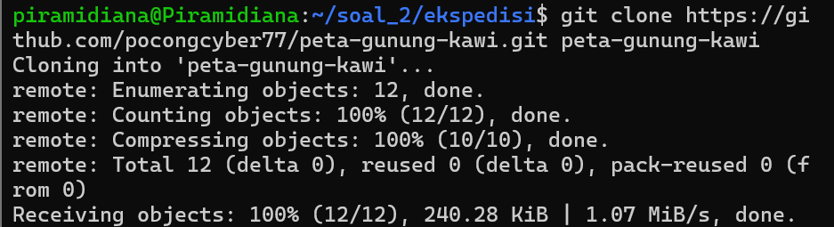
3. **Hasil parserkoordinat.sh**
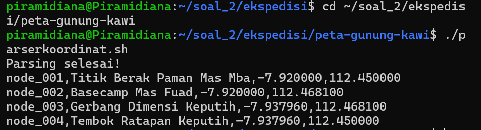
4. **Hasil nemupusaka.sh**
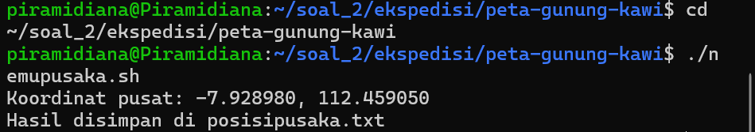

## Soal 3 - KOS SLEBEW AMBATUKAM
Soal 3 membuat sistem manajemen kost berbasis CLI menggunakan Bash script dengan fitur tambah penghuni, hapus penghuni, tampilkan daftar penghuni, update status dan cetak laporan keuangan, serta kelola cron job untuk pengingat tagihan.

### Cara Menjalankan
```
cd soal_3
chmod +x kost_slebew.sh
./kost_slebew.sh
```

### Output
1. **Menu Utama**
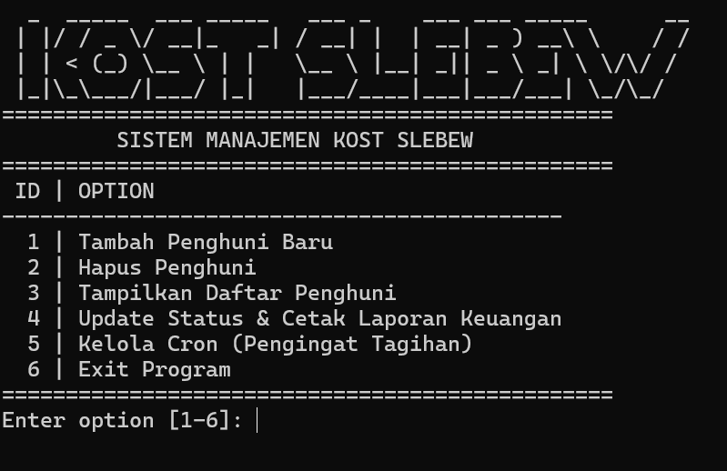
2. **Tambah Penghuni**
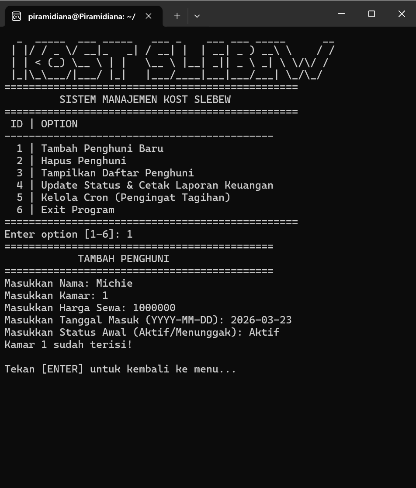
3. **Tampilkan Daftar Penghuni**
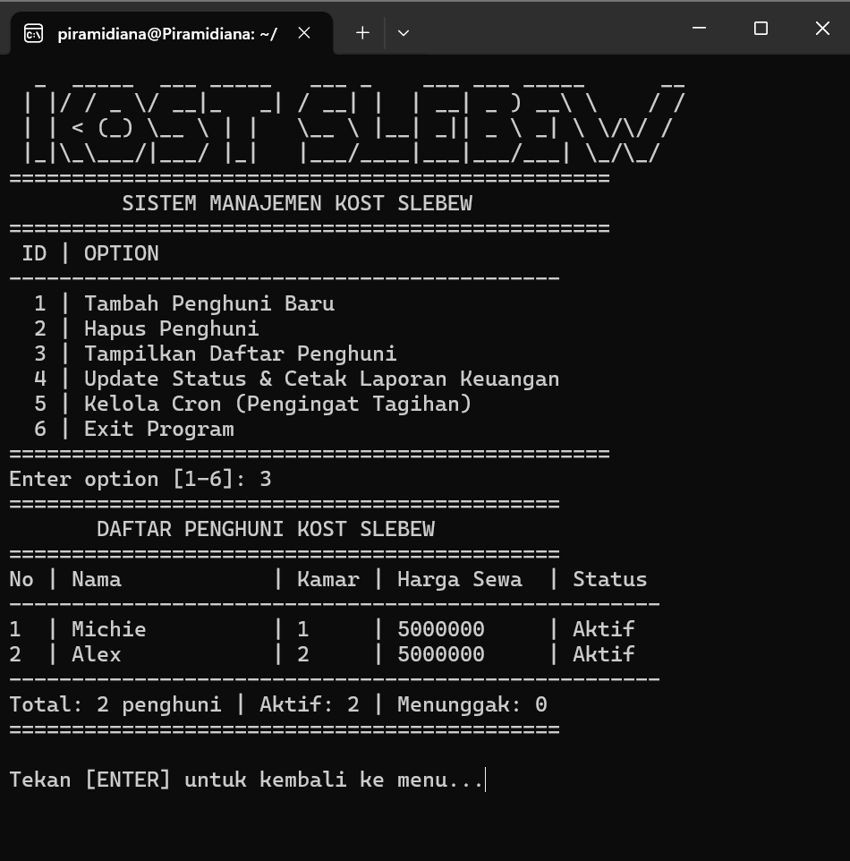
4. **Hapus Penghuni**
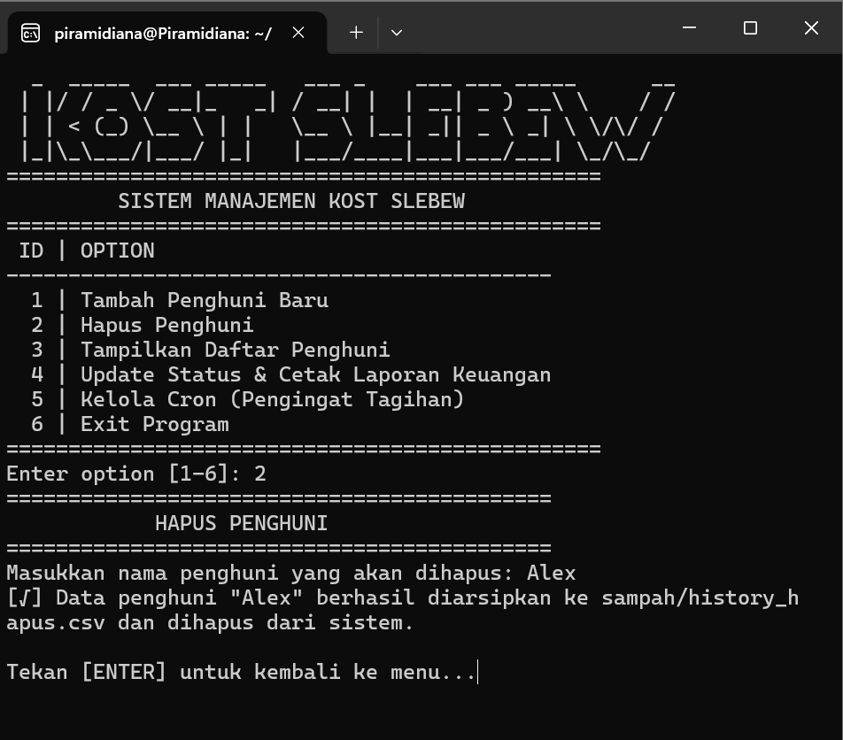
5. **Update Status & Laporan Keuangan**
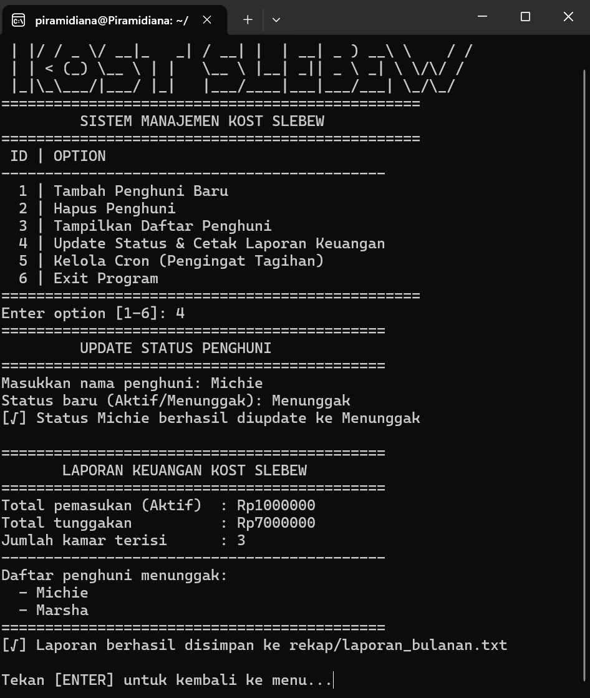
6. **Daftarkan Cron Job**
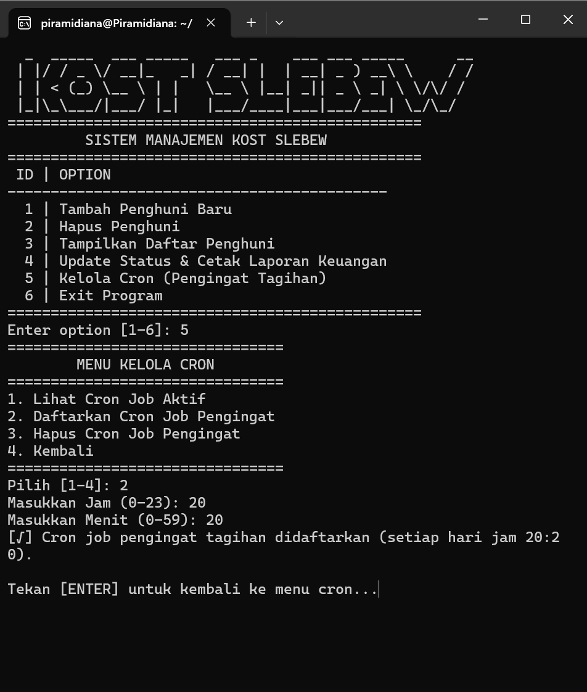
7. **Lihat Cron Job**
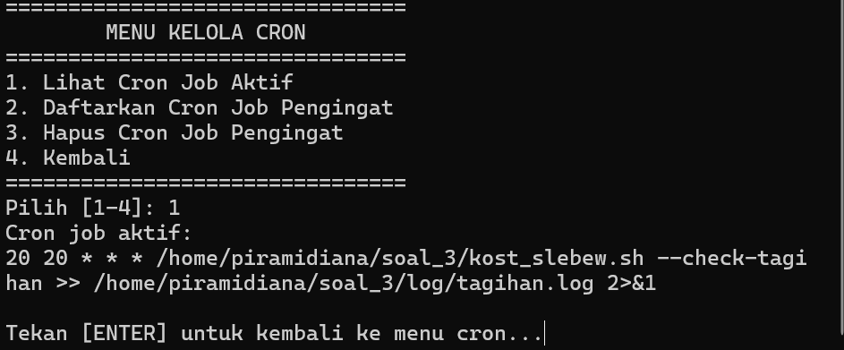
8. **Hapus Cron Job**
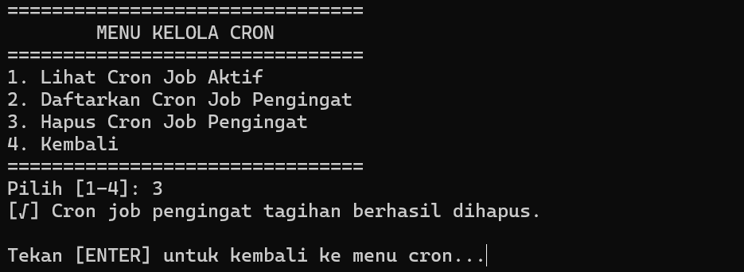

## Kendala

1. **User tidak punya akses sudo** — saat install pip dan gdown, harus switch ke root terlebih dahulu melalui PowerShell Windows dengan perintah `ubuntu2404 config --default-user root`
2. **Error syntax di nano** — beberapa perintah AWK yang kompleks susah diketik manual di nano, terutama bagian soal c di KANJ.sh karena banyak tanda kutip bertumpuk
3. **Terminal terjebak di mode input** — saat mencoba pakai `cat > file << EOF`, output binary PDF terbaca sebagai perintah sehingga terminal tidak bisa menerima input baru
4. **ASCII art berantakan** — font ASCII art terlalu lebar untuk ukuran terminal sehingga tampilan menjadi tidak rapi
5. **Embedded git repository** — folder `peta-gunung-kawi` hasil clone memiliki `.git` sendiri sehingga tidak bisa langsung di-push, harus dihapus `.git`-nya terlebih dahulu
## Struktur Repository
```
SISOP-1-2026-IT-031
├── README.md
├── soal_1
│   ├── KANJ.sh
│   └── passenger.csv
├── soal_2
│   └── ekspedisi
│       ├── peta-ekspedisi-amba.pdf
│       └── peta-gunung-kawi
│           ├── gsxtrack.json
│           ├── parserkoordinat.sh
│           ├── nemupusaka.sh
│           ├── titik-penting.txt
│           └── posisipusaka.txt
├── soal_3
│   ├── kost_slebew.sh
│   ├── data
│   │   └── penghuni.csv
│   ├── log
│   │   └── tagihan.log
│   ├── rekap
│   │   └── laporan_bulanan.txt
│   └── sampah
│       └── history_hapus.csv
└── assets
    ├── soal_1
    ├── soal_2
    └── soal_3
```
